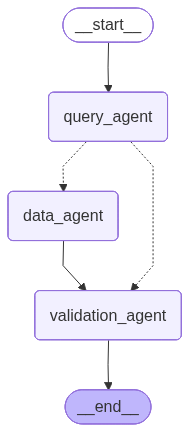

# Retail Insights Assistant

A **GenAI-powered multi-agent system** for analyzing retail sales data using natural language queries. Built with LangGraph, SQLite3, and Groq/Gemini LLMs.

## Features

- **Text-to-SQL** conversion using curated prompt engineering.
- **Multi-agent architecture**:
  - **Query Agent**: Logic for translating natural language to SQLite.
  - **Data Agent**: Robust execution and error handling.
  - **Validation Agent**: Business insight generation and response verification.
- **Two modes**: QA (specific questions) and Summary (dataset overview).
- **SQLite3** data layer for efficient local analysis.
- **Natural language** answers with professional business insights.

## Architecture

```text
User Input → Query Agent → Data Agent → Validation Agent → Natural Language Answer
              (Text→SQL)    (Execute)     (Verify & Summarize)
```

### LangGraph Workflow

The system uses **LangGraph** to orchestrate a stateful, multi-agent workflow. This allows for complex logic, error handling, and contextual memory across conversation turns.



#### 1. Operation Modes

- **QA Mode**: Used for specific user questions. The `Query Agent` uses conversation history and table schema to generate targeted SQL queries.
- **Summary Mode**: Used for high-level dataset overviews. The `Query Agent` generates a series of comprehensive aggregation queries to analyze the entire table's distribution.

#### 2. Nodes & Responsibilities

- **Query Agent**: The entry point. It analyzes the user's intent, the database schema, and history to produce a valid SQLite query. If the user's request is ambiguous, it returns a `CLARIFICATION_REQUIRED` signal.
- **Data Agent**: Responsible for safe execution. It runs the generated SQL against the SQLite database, handles execution errors, and formats the raw result sets.
- **Validation Agent**: The final step. It reviews the data results and translates them into a professional, insight-driven natural language response.

#### 3. Conditional Routing

The graph implements **smart routing** based on the output of the Query Agent:

- **Standard Path**: `Query Agent` → `Data Agent` → `Validation Agent`. This is used when a valid SQL query is generated.
- **Clarification Path**: `Query Agent` → `Validation Agent`. If the Query Agent identifies an ambiguous request, it skips the Data Agent entirely and routes directly to Validation to ask the user for more details.

## Execution Guide

Follow these steps to set up and run the assistant on your local machine.

### 1. Prerequisite: Python Environment

Ensure you have Python 3.10 or higher installed.

```bash
# Clone the repository
# cd Retail-Insights-Assistant

# Create a virtual environment
python -m venv .venv

# Activate the virtual environment
# On macOS/Linux:
source .venv/bin/activate
# On Windows:
# .venv\Scripts\activate
```

### 2. Install Dependencies

```bash
pip install -r requirements.txt
```

### 3. Set Up Environment Variables

Create a `.env` file in the root directory and add your API keys. The application supports Groq (default).

```env
GROQ_API_KEY=your_groq_api_key_here
```

### 4. Initialize Database

Before running the app, you need to convert the raw CSV data into a SQLite database. This script handles data cleaning and schema creation.

```bash
python sql/setup_database.py
```

### 5. Run the Application

Start the modern web-based assistant:

```bash
streamlit run streamlit_app.py
```

## Usage

Once the application is running:

1. **Select a table** from the detected CSVs.
2. **Choose a mode**:
   - **QA Mode**: Ask specific questions like *"Which product line had the highest sales in Q3?"*
   - **Summary Mode**: Get an automated business overview of the entire table.

## Project Structure

```text
Retail-Insights-Assistant/
├── agents/
│   ├── query_agent.py      # Text-to-SQL generation
│   ├── data_agent.py       # SQL execution & formatting
│   ├── validation_agent.py # Insight verification & summary
│   └── state.py            # LangGraph state definition
├── configs/
│   ├── config.py           # LLM configurations and env variables loader
├── prompts/
│   ├── qa_sql_prompt.txt      # Prompt for QA mode
│   ├── summary_sql_prompt.txt # Prompt for Summary mode
│   └── validation_prompt.txt  # Human-readable insight prompt
├── sql/
│   ├── setup_database.py   # Data ingestion & cleaning script
│   └── retail_data.db      # Generated SQLite database
├── utils/
│   └── db_utils.py          # Database helper functions
├── data/                    # Raw CSV datasets
├── graph.py                 # LangGraph workflow definition
├── streamlit_app.py         # Main entry point (Streamlit UI)
└── requirements.txt
```

## Technologies

- **LangGraph & LangChain**: Multi-agent orchestration and state management.
- **SQLite3**: Local relational database for structured querying.
- **Groq**: Ultra-fast LLM inference (Llama 3 / Mixtral).
- **Pandas**: Data cleaning and preprocessing during ingestion.

---

## Technical Notes

### Assumptions

- **Schema Mapping**: Assumes CSV column names are descriptive enough for the LLM to infer their business context (e.g., `gross_amt` as revenue).
- **Relational Logic**: Assumes business questions can be accurately answered through standard SQL aggregations and filters.
- **Structured Data**: Assumes input files follow a tabular structure consistent across the dataset.
- **Partial Matching**: Built on the assumption that users may use partial or case-insensitive names, handled via robust `LOWER` and `LIKE` SQL patterns.

### Limitations

- **Single-Table Scope**: Optimized for deep-dive analysis into one table at a time; multi-table joins are not supported in this iteration.
- **Predictive Analytics**: Current scope is focused on descriptive/diagnostic historical analysis rather than predictive modeling or forecasting.
- **SQLite Concurrency**: Best suited for local analytical workloads; not designed for high-concurrency enterprise write operations.
- **Natural Language Edge Cases**: Extremely vague or symbolic queries may still require manual user clarification.

### Scaling to 100GB+ (Future Roadmap)

To transition this local prototype into an enterprise-scale system handling 100GB+ datasets, the following enhancements are planned:

1. **Distributed Data Ingestion**: Transition to batch/stream ingestion into a Data Lake with distributed preprocessing and incremental ETL pipelines.
2. **Partitioned Storage**: Migration from flat CSVs to partitioned **Parquet/Delta** formats (by date, region, or category) for efficient sub-set scanning.
3. **Scalable Query Engines**: Moving the storage layer to an analytical warehouse (e.g., Snowflake, BigQuery) for high-performance server-side aggregations.
4. **Semantic Metadata Search**: Implementing vector-based (RAG) schema retrieval to provide the LLM with only the most relevant table context for each query.
5. **Pre-Aggregated KPI Tables**: Maintaining materialized views and summarized metrics so the LLM interacts with high-level insights rather than raw row data.
6. **Advanced Orchestration**: Integration of **LangGraph Checkpointer** for error recovery and state persistence, alongside async agent execution.
7. **Performance Caching**: Implementing semantic caching (Redis) for natural language responses and query results to improve concurrency and reduce cost.
8. **Enterprise Monitoring**: Deploying an observability stack to track SQL latency, token usage, and the accuracy of the automated validation layer.
